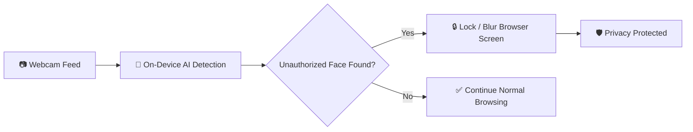
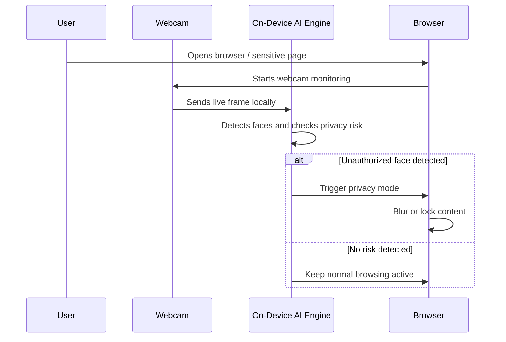

<div align="center">

# 🧠 NeuroSecure

### AI-Powered Real-Time Privacy Protection for Browsers


<br/>

<a href="https://incomparable-wisp-91385a.netlify.app/">
  
</a>


<br/><br/>


</div>

---

## 🚀 About NeuroSecure

**NeuroSecure** is an intelligent Google Chrome browser extension built to protect users from unwanted screen viewing and shoulder surfing attacks. It uses **on-device artificial intelligence** to observe the webcam feed locally, recognize unauthorized faces around the user, and immediately secure the browser by **blurring or locking sensitive content**.

The goal is simple: **keep private information private, even in public or shared environments.**

---

## ✨ Core Idea

<div align="center">



</div>

---

## 🌐 Live Demo

<div align="center">

### 🔗 Experience NeuroSecure Online

<a href="https://incomparable-wisp-91385a.netlify.app/">
  
</a>

</div>

---

## 🔥 Key Features

<table>
<tr>
<td width="50%">

### 👁️ Real-Time Monitoring
Continuously observes the webcam feed to detect nearby faces while the user is browsing.

</td>
<td width="50%">

### 🧠 On-Device AI
Processes detection locally on the device, reducing dependency on external servers.

</td>
</tr>
<tr>
<td width="50%">

### 🚨 Unauthorized Face Detection
Identifies unexpected faces and reacts instantly to protect sensitive content.

</td>
<td width="50%">

### 🔒 Auto Lock / Blur
Automatically hides the browser screen when a privacy risk is detected.

</td>
</tr>
<tr>
<td width="50%">

### 🌍 Public-Space Protection
Useful in labs, offices, universities, cafes, libraries, and coworking spaces.

</td>
<td width="50%">

### ⚡ Fast Response
Designed for quick detection and immediate privacy action.

</td>
</tr>
</table>

---

## 🛡️ Why NeuroSecure?

In many real-life situations, users work with confidential data in open spaces. A person standing behind the user may unintentionally or intentionally view private information. NeuroSecure reduces this risk by acting like a **smart privacy shield** for the browser.

### Best For

- Students working in university labs  
- Professionals handling confidential documents  
- Developers managing private dashboards  
- Users browsing sensitive accounts in public places  
- Offices and coworking environments  

---

## 🧩 Technology Stack

<div align="center">


</div>

<br/>

| Category | Technologies |
|---|---|
| AI / Computer Vision | Python, OpenCV, YOLO, MediaPipe |
| Browser Extension | JavaScript, Chrome Extension APIs |
| Frontend | HTML, CSS, JavaScript |
| Deployment | Netlify |
| Version Control | Git, GitHub |

---

## ⚙️ How It Works



---

## 📸 Project Preview

<div align="center">


</div>

---

## 📁 Project Structure

```bash
NeuroSecure/
│
├── extension/
│   ├── manifest.json
│   ├── background.js
│   ├── content.js
│   ├── popup.html
│   ├── popup.css
│   └── popup.js
│
├── ai-model/
│   ├── face_detection.py
│   ├── privacy_engine.py
│   └── utils.py
│
├── assets/
│   ├── icons/
│   └── screenshots/
│
├── website/
│   ├── index.html
│   ├── style.css
│   └── script.js
│
└── README.md
```

---

## 🧪 Main Functional Flow

1. User enables NeuroSecure in Chrome.  
2. Webcam monitoring starts with user permission.  
3. AI model detects faces in the camera frame.  
4. If an unauthorized face appears, privacy mode activates.  
5. Browser content is instantly blurred or locked.  
6. Once the risk is gone, the browser returns to normal mode.  

---

## 🚀 Getting Started

### 1. Clone the Repository

```bash
git clone https://github.com/your-username/NeuroSecure.git
cd NeuroSecure
```

### 2. Install Required Python Packages

```bash
pip install opencv-python mediapipe numpy
```

### 3. Load Chrome Extension

1. Open Google Chrome  
2. Go to `chrome://extensions/`  
3. Turn on **Developer Mode**  
4. Click **Load unpacked**  
5. Select the `extension` folder  

---

## 🎯 Future Improvements

- Face recognition for trusted users  
- Custom privacy sensitivity levels  
- Smart blur intensity control  
- Sound alert on privacy risk  
- Dashboard for privacy logs  
- Support for multiple browsers  
- Lightweight AI model optimization  

---

## 🏆 Highlights

<div align="center">


</div>

---

## 👨‍💻 Developed By

<div align="center">

### Muhammad Bilal Ashiq

**Computer Science Student | AI/ML Enthusiast | Web & Python Developer**

<a href="https://github.com/bashiq031">
  
</a>
<a href="https://incomparable-wisp-91385a.netlify.app/">
  
</a>

</div>

---

## ⭐ Support

If you like this project, give it a ⭐ on GitHub and share it with others who care about digital privacy.

<div align="center">


<br/>


</div>
